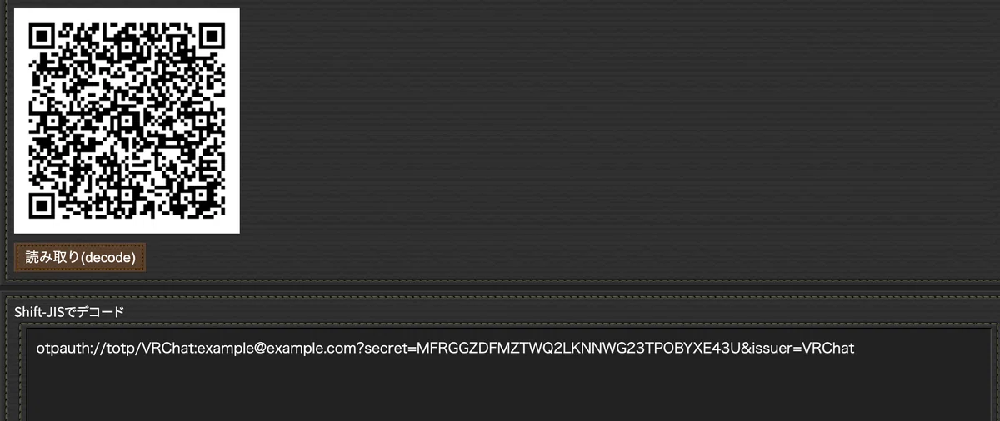

# VRChan (Win版)

VRChat のグループインスタンスを定期的に監視し、Discord の Webhook に通知する Windows 常駐アプリです。

Python 版 vrchan の「グループインスタンス通知」機能のみを Windows 向けに移植したもので、タスクトレイ常駐・GUI 設定・ローカルファイルでの状態管理を行います。

> 詳細な背景や Python 版の解説は、以下の Note を参考にしてください。
>
> https://note.com/osa9/n/na04ac7f98701

---

## 機能概要

- VRChat API を利用して指定したグループのインスタンス一覧を取得
- 新規に出現したインスタンスを Discord Webhook に通知
- VRChat ログイン時の TOTP（二要素認証）に対応
- 設定画面（WinForms）から各種設定を GUI で変更

---

## 動作環境

- Windows 10 / 11
- .NET 10.0 （ランタイムが必要）
- VRChat アカウント（2FA/TOTP 有効を推奨）
- Discord Webhook URL

GitHub Release から配布される ZIP をダウンロードし、展開するだけで利用できます。
ソースコードからビルドする場合は後述の「ビルド方法」を参照してください。

---

## インストールと初回起動

1. GitHub の Release ページから最新の `VrchanWin.zip` をダウンロードします。
2. 任意のフォルダに ZIP を展開します。
3. 展開したフォルダ内の `VrchanWin.exe` をダブルクリックして起動します。
4. 初回起動時は設定が空のため、自動的に設定画面が表示されます。

アプリはタスクトレイに常駐します。タスクトレイのアイコン（VRchan のアイコン）を右クリックするとコンテキストメニューが開きます。

---

## 設定項目

初回起動時、またはタスクトレイメニューから「設定...」を選ぶと設定画面が開きます。

### VRChat 設定

- **VRChat ユーザー名**  
	VRChat にログインするためのユーザー名（メールアドレスまたは ID）。

- **VRChat パスワード**  
	上記アカウントのパスワード。

- **グループ ID**  
	監視対象とする VRChat グループの ID。
    VRChatのWebサイトでグループを表示した際のURLのgrp_xxxxxxxxxxxxxxxxxxxxxxxの部分です。

### TOTP（二要素認証）

- **TOTP シークレットキー**  
	VRChat アカウントの 2 段階認証（Google Authenticator など）に使っているシークレットキー（Base32）。
	Authenticatorに登録する際に表示される QR コードをデコードすると取得できます。
    例えば「otpauth://totp/VRChat:example@example.com?secret=MFRGGZDFMZTWQ2LKNNWG23TPOBYXE43U&issuer=VRChat」とデコードされた場合は「MFRGGZDFMZTWQ2LKNNWG23TPOBYXE43U」がシークレットキーです。

    

### Discord 設定

- **Discord Webhook URL**  
	通知を送信する Discord チャンネルの Webhook URL。

	Webhook の作成方法については、設定画面内のリンクラベルからブラウザを開くこともできます。
      

### 動作設定

- **監視間隔（分）**  
	VRChat グループインスタンスをチェックする間隔（分単位）。 結構レートリミット制限厳しいので15分以上に設定したおいた方がよいかと思います。
	例: `5` とすると 5 分ごとに VRChat API を叩いて新しいインスタンスを確認します。

設定を入力したら「保存」ボタンを押すと、設定が `%AppData%/Vrchan/config.json` に保存されます。
現在は暗号化などしていないので、第三者に見られないよう注意してください。

---

## 通知の挙動

### 新規インスタンス

- 監視対象グループに新しいインスタンスが現れた場合、以下を行います。
	- Discord Webhook へ 通知

### 再通知のルール

- すでに通知済みのインスタンスについては、
	- 「最後に通知してから 4 時間以上経過している」
	- その中で「最も古く通知した」インスタンス
	の 1 件だけを再通知します。

これにより、同じインスタンスが長時間立ち上がっている場合でも、一定間隔で控えめに再通知されます。

### 状態ファイル

- 通知済みインスタンスの情報は、実行ファイルと同じフォルダにある `notified_instances.json` に保存されます。
- フォーマットはシンプルな JSON で、キーがインスタンス ID、値が最終通知日時（`DateTime`）です。
- クリーンな状態からやり直したい場合は、アプリを終了した上でこのファイルを削除してください。

---

## タスクトレイからの操作

タスクトレイのアイコンを右クリックすると以下のメニューが表示されます。

- **設定...**  
	設定画面を開きます。

- **ログ...**  
	アプリ内部のログを表示するウィンドウを開きます。  
	VRChat API のレスポンスやエラー、TOTP 認証の状況、Discord への送信結果などが確認できます。

- **今すぐチェック**  
	監視間隔を待たずに、即座に VRChat グループインスタンスのチェックと通知を行います。

- **終了**  
	アプリを終了します。

---

## ログについて

- 「ログ...」メニューから専用ウィンドウを開くと、直近のログを確認可能です。
- TOTP 認証エラーや VRChat API のエラーが出た場合もここに詳細が出力されます。

トラブルが発生した際は、まずログを確認してください。

---

## ビルド方法（開発者向け）

ソースからビルドする場合:

1. .NET 10 SDK をインストールします。
2. このリポジトリをクローンします。

	 ```powershell
	 git clone <your-repo-url>
	 cd VrchanWin
	 ```

3. 依存パッケージを復元してビルドします。

	 ```powershell
	 dotnet restore
	 dotnet build
	 ```

4. 実行するには以下を使います。

	 ```powershell
	 dotnet run
	 ```

5. 配布用に単一ファイルとして publish する場合（win-x64 の例）:

	 ```powershell
	 dotnet publish VrchanWin.csproj --configuration Release --runtime win-x64 --self-contained false -p:PublishSingleFile=true -p:IncludeNativeLibrariesForSelfExtract=true -o publish
	 ```

GitHub Actions を利用している場合は、`main` ブランチへの push をトリガーに、自動でビルド＆ZIP 化＆Release 作成が行われる設定になっています。

---

## 注意事項

- VRChat と Discord の利用規約に則ってご利用ください。
- VRChat API の仕様変更により、本アプリが動作しなくなる可能性があります。
- パスワードや TOTP シークレットキーは厳重に管理し、第三者と共有しないでください。

---

## ライセンス / クレジット

- Python 版 vrchan および関連解説記事:  
	https://note.com/osa9/n/na04ac7f98701

このリポジトリ自体のライセンスについては、ルートディレクトリの LICENSE ファイル（存在する場合）を参照してください。
